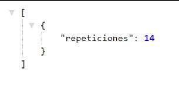
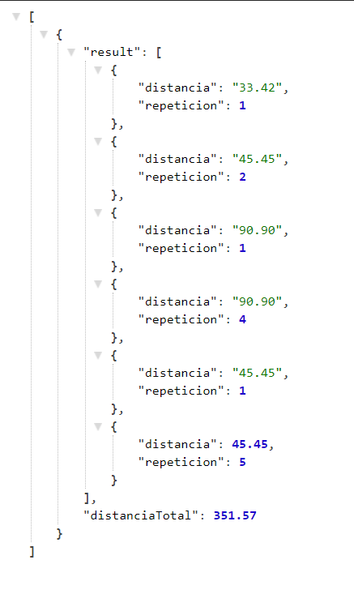
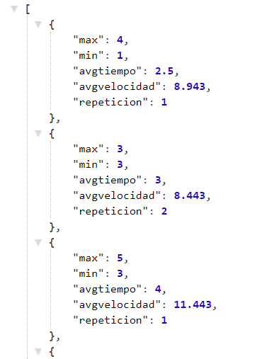
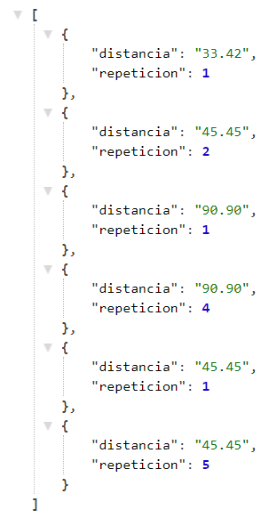
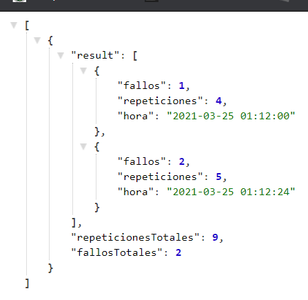
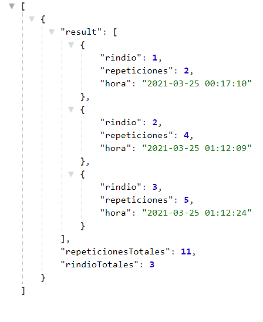

# APIS 
- [APIS](#apis)
  - [General Web](#general-web)
  - [Proyecto Reportes](#proyecto-reportes)
  - [Nota](#nota)
## General Web
* Velocidad en tiempo real del atleta; el formato json que rotorna es el siguiente

        https://anvw15k3m7.execute-api.us-east-2.amazonaws.com/ace2-dev/get-all-velocity/{idUser}

* Repeticiones que lleva acumuladas; el formato json que rotorna es el siguiente
  
        https://anvw15k3m7.execute-api.us-east-2.amazonaws.com/ace2-dev/get-all-repeticiones/{idUser}

* Distancia recorrida en tiempo real (Total y en la repetición actual); el formato json que rotorna es el siguiente

        https://anvw15k3m7.execute-api.us-east-2.amazonaws.com/ace2-dev/get-all-distancia/{idUser}

* Ritmo Cardiaco, es el mismo de la practica1 

## Proyecto Reportes 
Reporte 2: Velocidad alcanzada aqui devuelvo el siguiente JSON con la siguiente estructura.
    
    https://anvw15k3m7.execute-api.us-east-2.amazonaws.com/ace2-dev/get-velocity-report/{idUser}

1. max
2. min
3. avgtiempo
4. avgvelocidad
5. repeticion

Reporte 3: El usuario podrá visualizar la distancia recorrida que la prenda midió por cada repetición, esto para verificar la exactitud con la que mide este dato la prenda.

     https://anvw15k3m7.execute-api.us-east-2.amazonaws.com/ace2-dev/get-distance-report/{idUser}

Reporte 4: El usuario podrá ver cuántas veces ha fallado y cuantas repeticiones hizo antes de fallar, durante todo el tiempo (desde que creó su cuenta)
    
    https://anvw15k3m7.execute-api.us-east-2.amazonaws.com/ace2-dev/get-fails-report/{idUser}

Reporte 5: El usuario podrá ver cuántas veces se ha rendido y cuantas repeticiones hizo antes de rendirse, durante todo el tiempo (desde que creó su cuenta).

    https://anvw15k3m7.execute-api.us-east-2.amazonaws.com/ace2-dev/get-giveup-report/{idUser}

Nota: idUser es para retornar solo los datos de dicho usuario, puedes obtener el id cuando inicia sesion, ya que aqui retorno todo la informacion del usuario en un JSON y podrias guardarlo por localstorage para que se te facilite manejar esta informacion para las validaciones     

## Nota 
1. Falta un reporte el primero xd.

